# 🌡️ Mini-projet Spring - Convertisseur de Températures

[](https://spring.io/)
[](https://www.java.com/)

Un projet démonstratif des principes **IoC (Inversion of Control)** et **DI (Dependency Injection)** avec Spring Framework.

## 📖 Introduction
Ce mini-projet a pour but de découvrir les principes d'IoC et d'injection de dépendances avec Spring en créant une petite application de conversion de températures entre différentes unités (Celsius (°C), Fahrenheit (°F), Kelvin (K)).

**Objectifs pédagogiques** :
- ✅ Implémentation de l'IoC (Inversion of Control)
- ✅ Trois méthodes d'injection de dépendances :
  - Par attribut
  - Par constructeur
  - Par setter
- ✅ Comparaison **XML** vs **Annotations**
- ✅ Architecture en couches (DAO/Métier/Présentation)

## 🏗️ Architecture du projet:


## ⚙️ Configuration
### Fichier `pom.xml`
```xml
    <dependencies>
        <!-- Spring Core Container -->
        <dependency>
            <groupId>org.springframework</groupId>
            <artifactId>spring-context</artifactId>
            <version>6.1.14</version>
        </dependency>

        <!-- For XML Configuration Support -->
        <dependency>
            <groupId>org.springframework</groupId>
            <artifactId>spring-beans</artifactId>
            <version>6.1.5</version>
        </dependency>

        <!-- Modern Spring (includes core, beans, context, expression) -->
        <dependency>
            <groupId>org.springframework</groupId>
            <artifactId>spring-core</artifactId>
            <version>6.1.5</version>
        </dependency>

        <!-- Jakarta Dependency Injection -->
        <dependency>
            <groupId>jakarta.inject</groupId>
            <artifactId>jakarta.inject-api</artifactId>
            <version>2.0.1</version>
        </dependency>

        <!-- Testing -->
        <dependency>
            <groupId>org.springframework</groupId>
            <artifactId>spring-test</artifactId>
            <version>6.1.5</version>
            <scope>test</scope>
        </dependency>
        <dependency>
            <groupId>org.junit.jupiter</groupId>
            <artifactId>junit-jupiter-engine</artifactId>
            <version>5.10.1</version>
            <scope>test</scope>
        </dependency>
        <dependency>
            <groupId>org.junit.jupiter</groupId>
            <artifactId>junit-jupiter-api</artifactId>
            <version>5.10.1</version>
            <scope>test</scope>
        </dependency>
    </dependencies>
```
## 📦 Structure des packages
### 📁 Package dao (couche données) : couche d'accès aux taux de conversion
Ce package contient :
- Interface IDao: Définit une méthode getTauxConversion(String from, String to) qui retourne le taux de conversion entre deux unités de température
  
  

- Classe DaoImpl: Implémentation avec des taux fixes:
    - Celsius → Fahrenheit: ×1.8 + 32
    - Fahrenheit → Celsius: -32 ×5/9
    - Celsius → Kelvin: +273.15
      
  


### 📁 Package ext : alternative/deuxième version DAO
- DaoImpl2: Deuxième implémentation de l’interface IDao avec des taux légèrement différents pour démontrer l'injection dynamique
  
  


### 📁 Package metier : couche métier
Ce package contient :
- Interface IMetier: Définit une méthode convertir(String from, String to, double valeur)
  
  

- Classe MetierImpl: Implémentation avec trois types d'injection:
    - Injection par constructeur
    - Injection par setter
    - Injection par annotation @Autowired

      
  


### 📁 Package pres : couche de présentation
Ce package contient :
- PresSpringAnnotation: Utilise AnnotationConfigApplicationContext pour configurer Spring via annotations qui scanne automatiquement le package 'net.safae' pour détecter les composants Spring (@Component, etc.) et configure l'injection automatique des dépendances.
  
  

- PresSpringXML: Utilise un fichier config.xml pour la configuration XML (déclarer et injecter manuellement les beans Spring)
  
  


### 📄 config.xml


### 🖥 Résultats
Lorsque l’on exécute la classe de présentation, le programme affiche le résultat de la conversion.
- Avec Annotations :
  
  

- Avec XML :
  
  

## 📚 Acquis pédagogiques

Ce projet m'a permis de développer les compétences suivantes :

### 🧠 Compréhension approfondie
- **Injection de dépendances** :  
  🔄 Mécanisme d'injection dynamique  
  🏗️ Souplesse architecturale avec Spring  
  ✨ Application du principe **OCP** (Open/Closed Principle) :
  ```java
  // Exemple : Changement de DAO sans modifier le code métier
  @Autowired
  private IDao dao; // Peut être DaoImpl ou DaoImpl2
  ```

## 🔄 Diagramme d'Évolutivité

```mermaid
graph TD
    A[Modification Requise] --> B{Type de Changement?}
    B -->|DAO| C[📦 Couche dao seulement]
    B -->|Métier| D[🛠️ Couche metier seulement]
    C --> E[✅ Autres couches inchangées]
    D --> E
    E --> F[🏁 Application fonctionnelle]
    
    style A fill:#f9f,stroke:#333
    style B fill:#bbf,stroke:#333
    style C fill:#6f6,stroke:#333
    style D fill:#6f6,stroke:#333
    style E fill:#4af,stroke:#333
    style F fill:#8f8,stroke:#333
```


    
## Conclusion:
Ce projet de convertisseur de températures a été une excellente opportunité pour :

### 🛠️ Renforcement des compétences techniques
- **Maîtrise approfondie** des principes IoC/DI de Spring
- **Implémentation concrète** des différents types d'injection :
  ```java
  // Injection par constructeur
  public MetierImpl(IDao dao) {
      this.dao = dao;
  }

## Auteur :
**Safae ERAJI**  
